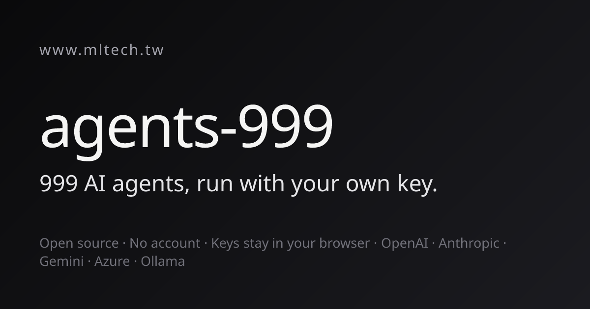
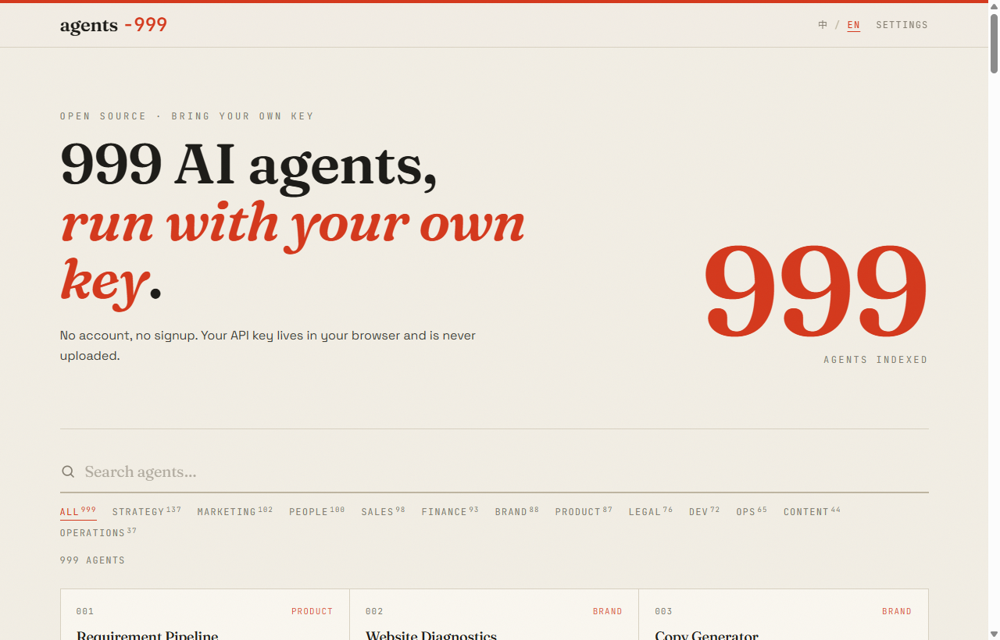
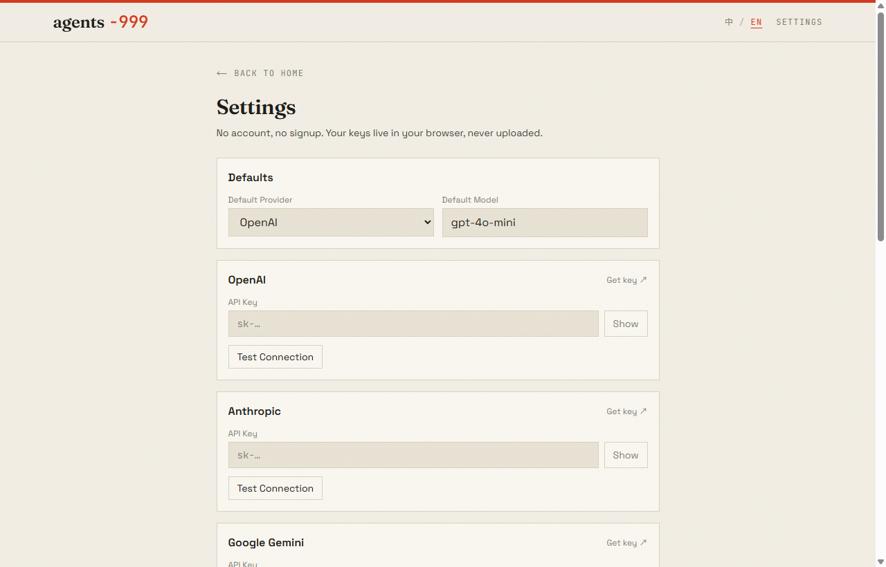

<div align="center">

# agents-999

**999 free AI consultant agents. Bring your own API key.**

[](https://agents-999.vercel.app)
[](./LICENSE)
[](https://nextjs.org)
[](https://www.typescriptlang.org)
[](https://vercel.com/new/clone?repository-url=https://github.com/mltech-ai-tw/agents-999)

**English** · [繁體中文](./README.zh-TW.md)

<a href="https://agents-999.vercel.app"></a>

</div>

**agents-999** is a free, open-source, self-hostable **AI agents** web app — a
**ChatGPT-style** library of **999 AI business consultants** (strategy,
marketing, sales, finance, legal, product, dev and more) that you run with your
**own LLM API key** (**BYOK — bring your own key**). No account, no signup, no
subscription, and no data sent anywhere except the LLM provider you pick.
**API keys live in your browser's `localStorage` only** — they're forwarded to
the server purely to proxy a single request and are never stored.

Built with **Next.js 15 · React 19 · TypeScript · Tailwind CSS**. Supports
**OpenAI (GPT) · Anthropic (Claude) · Google Gemini · Ollama (local) · Mistral ·
Groq · Azure OpenAI**.

👉 **[Try the live demo →](https://agents-999.vercel.app)** · no key needed to browse all 999 agents

---

## Quick Start

```bash
git clone https://github.com/mltech-ai-tw/agents-999
cd agents-999
npm install
npm run dev
# Open http://localhost:3000 → Settings → add your API key → run any agent
```

## Deploy

[](https://vercel.com/new/clone?repository-url=https://github.com/mltech-ai-tw/agents-999)

Runs on any Node.js host — Vercel, Railway, Render, Fly.io, or self-hosted.
There are **no server-side secrets** to configure: keys come from each visitor's
browser at request time.

```bash
npm run build
npm start
```

---

## Make it your own

This project is meant to be **forked and rebranded**. All branding lives in one
file — [`lib/site.ts`](./lib/site.ts):

```ts
export const SITE = {
  name: "agents-999",                 // masthead + page title
  tagline: { zh: "…", en: "…" },      // hero headline
  subtitle: { zh: "…", en: "…" },     // hero sub-line
  attribution: "",                    // optional footer credit ("" = none)
  attributionUrl: "",
  repoUrl: "https://github.com/…",
};
```

Change `name` and the masthead, title, and footer update automatically (a `-999`
style suffix is rendered in the accent colour). Leave `attribution` empty for a
fully white-label build, or set it to your own name/company. Recolour the whole
UI from the CSS variables at the top of [`app/globals.css`](./app/globals.css).
No other file hardcodes a brand.

---

## How it works

```
User input → /api/run → lib/llm/router → provider → SSE stream → UI (typewriter)
```

Your API key travels: `localStorage → request header → /api/run (used, never stored) → provider API`

- **Home (`/`)** — searchable, category-filtered grid of all 999 agents.
- **Runner (`/tools/[id]`)** — dynamic form per agent, model selector (only shows
  providers you've configured), live-streaming output with copy/reset.
- **Settings (`/settings`)** — one section per provider, show/hide keys,
  per-provider "Test Connection", default provider/model, Clear All.

Everything is bilingual (繁體中文 / English) via a header toggle.

---

## Screenshots

| Home — searchable grid of all 999 agents | Settings — bring your own key |
|:---:|:---:|
| [](https://agents-999.vercel.app) | [](https://agents-999.vercel.app/settings) |

> ▶ **[Open the live demo →](https://agents-999.vercel.app)** — browse all 999 agents for free; add your own key to run any of them.

---

## Agent categories

All 999 agents are organised into 12 categories. Use the search + category filter
on the home page to find one fast.

| Category | Count | What's inside |
|----------|------:|---------------|
| 🧭 **Strategy** | 137 | Market entry, growth, transformation, M&A, competitive intelligence, scenario planning |
| 📣 **Marketing** | 102 | Campaigns, SEO, content, social, paid ads, launches, retention |
| 👥 **People** | 100 | Hiring, performance, culture, leadership, org design, compensation |
| 🤝 **Sales** | 98 | Pipeline, proposals, negotiation, customer success, playbooks, enablement |
| 💰 **Finance** | 93 | Fundraising, valuation, ROI, forecasting, investor relations, pricing |
| ✨ **Brand** | 88 | Identity, naming, positioning, storytelling, PR, crisis comms |
| 📦 **Product** | 87 | Roadmaps, specs, discovery, metrics, user research, prioritization |
| ⚖️ **Legal** | 76 | Contracts, compliance, data privacy, ESG, grants, due diligence |
| 💻 **Dev** | 72 | Architecture, tech-stack selection, API docs, technical debt, automation |
| ⚙️ **Ops** | 65 | Process optimization, meetings, vendors, stakeholders, supply chain |
| 📝 **Content** | 44 | Copywriting, editorial, scripts, documentation |
| 🔧 **Operations** | 37 | Day-to-day execution, workflows, coordination |

---

## Featured agents

Every agent runs on a smart bilingual prompt builder. The **200 flagship agents**
below additionally ship with **hand-tuned input forms and structured prompts** —
they return Markdown tables, data charts (` ```chart `) and Mermaid diagrams
(` ```mermaid `) where it helps. Expand a category to browse them.

<details>
<summary><b>🧭 Strategy</b> — 53 featured</summary>

- **Transformation Roadmap** · 轉型路線圖 — Maturity assessment → 3-phase plan → risk review
- **Business Plan Review** · 商業計畫審查 — Pro/con dual review, senior advisor rates and scores
- **Market Entry Analyst** · 市場進入分析師 — Competition / regulation / localization → GTM roadmap
- **Business Model Stress Test** · 商業模式壓力測試 — Bear/bull/scenario → investment grade & validation experiments
- **Partnership MOU Generator** · 合作備忘錄產生器 — Term structure / legal risk → ready-to-use MOU
- **Digital Transformation Maturity Assessor** · 數位轉型成熟度評估 — Diagnostic → CDO 3-year roadmap
- **AI Use Case Planner** · AI 應用場景規劃師 — Opportunity scan → process/customer/data AI → priority roadmap
- **Subscription Model Designer** · 訂閱制商業模式設計師 — Architecture → growth/churn/finance → MRR roadmap
- **Outsourcing Strategy Advisor** · 外包策略顧問 — Needs → cost-benefit / risk → outsourcing decision
- **Board Meeting Simulator** · 董事會模擬器 — CEO proposal → CFO/CMO/CTO/independent director → chair resolution
- **Corporate Crisis War Room** · 企業危機戰情室 — Commander → PR/legal/ops/social → golden 60-minute plan
- **AI Red Team Analyst** · AI 紅隊分析師 — Market/execution/finance/external 4-path attack → defense
- **Competitor Response Simulator** · 競爭對手回應模擬器 — Leader/challenger/niche war game → intelligence room
- **Workflow Automation Planner** · 工作流程自動化規劃師 — Process audit → AI agent / no-code / ROI
- **Strategic Pivot Advisor** · 策略轉型顧問 — Diagnostic → 3 directions → capital & communication plan
- **Data Story Generator** · 數據故事生成器 — Data insight → narrative + visualization + action plan
- **Industry Ecosystem Map** · 產業生態系地圖 — Positioning → player map + partnerships + dependency risks
- **Supply Chain Resilience Planner** · 供應鏈韌性規劃師 — Risk → diversification + contingency + visibility
- **M&A Target Analyst** · M&A 目標分析師 — Target criteria + synergy + integration plan + risks
- **PLG Strategy Designer** · PLG 策略設計師 — PLG assessment + freemium + activation + expansion
- **Franchise Feasibility Analyst** · 加盟可行性分析師 — Market + financial model + legal + expansion roadmap
- **Technical Debt Analyzer** · 技術債務分析器 — Diagnostic + architecture + code quality + repayment roadmap
- **International Expansion Planner** · 國際擴張規劃師 — Readiness + localization + compliance + GTM plan
- **API Documentation Generator** · API 文件生成器 — Endpoint specs + data model + SDK examples + error table
- **Competitive Feature Matrix** · 競品功能對比矩陣 — Feature matrix + gap analysis + blue-ocean + roadmap
- **AI Meeting Minutes Assistant** · AI 會議記錄助理 — Structured minutes + actions + follow-up email + Slack
- **User Interview Analyzer** · 用戶訪談分析師 — Insights + theme coding + product opportunities
- **Business Model Canvas Generator** · 商業模式畫布 — Full BMC + assumption validation + PMF + unit economics
- **A/B Test Designer** · A/B 測試設計師 — Hypothesis + sample size + segmentation + statistical guide
- **Competitor SWOT Analyst** · 競爭者 SWOT 分析師 — SWOT + TOWS strategy + differentiation map + 90-day plan
- **User Feedback Classifier** · 用戶回饋分類器 — Sentiment + theme classification + pain points + actions
- **User Retention Strategy Designer** · 用戶留存策略設計師 — Diagnostic + retention plan + economic impact
- **Startup Idea Factory** · 創業點子工廠 — 5 concepts + VC assessment + customer & feasibility analysis
- **Market Research Reporter** · 市場調研報告師 — Market size + landscape + consumer insights + entry strategy
- **Product Launch Planner** · 產品上市計畫師 — GTM strategy + execution plan + PR & social
- **Market Positioning Map Generator** · 市場定位地圖生成器 — Positioning map + differentiation + message architecture
- **Competitive Pricing Landscape Analyst** · 競爭定價全景分析師 — Pricing map + strategy + revenue optimization
- **KPI Designer** · KPI 設計師 — KPI framework + cascading alignment + dashboard planning
- **Competitive Intelligence Analyst** · 競爭情報分析師 — Threat assessment + signals + differentiation + playbook
- **AI Adoption Readiness Assessor** · AI 導入準備度評估師 — 6-dimension scoring + roadmap + risk barriers
- **Operations Efficiency Diagnostician** · 營運效率診斷師 — Process diagnostic + automation + metrics design
- **Strategic Alliance Proposal Advisor** · 策略聯盟提案師 — Synergy + proposal structure + relationship management
- **Executive Summary Generator** · 執行摘要生成器 — Full summary + multi-scenario versions + tailoring guide
- **Negotiation Coach** · 談判教練 — Leverage + tactics + counterpart psychology decoding
- **Decision Matrix Analyst** · 決策矩陣分析師 — Evaluation framework + weighted matrix + risk/regret analysis
- **Scenario Planner** · 情境規劃師 — Future scenarios + four-quadrant stories + resilience strategy
- **Enterprise Risk Assessor** · 企業風險評估師 — Risk identification + impact/probability matrix + mitigation
- **Process Optimization Advisor** · 流程優化顧問 — Bottleneck diagnostic + redesign + implementation plan
- **Sales Forecast Advisor** · 銷售預測顧問 — 3-scenario forecast + methodology + sales action plan
- **Growth Strategy Advisor** · 成長策略顧問 — Growth diagnostic + strategy design + execution roadmap
- **ESG Strategy Advisor** · ESG 策略顧問 — Materiality assessment + ESG strategy + disclosure reporting
- **Innovation Funnel Designer** · 創新漏斗設計師 — Innovation diagnostic + funnel + portfolio management
- **Supplier Audit Advisor** · 供應商稽核顧問 — Risk assessment + due diligence + contract management

</details>

<details>
<summary><b>📣 Marketing</b> — 28 featured</summary>

- **Competitor Analysis** · 競品分析 — Parallel positioning scrape → differentiation synthesis
- **Social Media Calendar** · 社群月曆 — Strategy → content → platform optimization, full month of posts
- **Cross-Channel Ad Generator** · 跨渠道廣告生成 — Strategist + Google/Meta/LinkedIn/YouTube
- **Competitive Intelligence Radar** · 競爭情報雷達 — Positioning + feature comparison → sales battle card
- **Customer Success Story** · 顧客成功故事 — Dramatization + metrics → website/LinkedIn/sales formats
- **Product Launch PR Kit** · 產品發布公關套件 — Press release/social/email + launch timeline & channels
- **Newsletter Strategist** · 電子報策略師 — Audience → content/growth/monetization + 30-day calendar
- **Digital Ad Audience Designer** · 數位廣告受眾設計師 — Meta/Google/LinkedIn audience design + media plan
- **Video Script Generator** · 影片腳本生成器 — Script/hooks/storyboard + full production plan
- **Client Case Study Writer** · 客戶案例研究撰寫師 — Problem/results/testimonial → complete case study
- **Pricing Page Optimizer** · 定價頁面優化師 — Pricing audit + plan redesign + copy + objection handling
- **Community Growth Planner** · 社群成長規劃師 — Health + acquisition + engagement + monetization
- **Product Hunt Launch Strategist** · Product Hunt 上線策略師 — Tagline + warm-up + content + launch-day checklist
- **SEO Keyword Researcher** · SEO 關鍵字研究師 — Core keywords + long-tail + content calendar + tech SEO
- **Landing Page Optimizer** · Landing Page 優化師 — CRO audit + copy rewrite + UX + CTA optimization
- **Ad Creative Generator** · 廣告素材生成器 — Full Meta/Google/video ad pack + creative strategy
- **Email Nurture Sequence Creator** · 電郵培育序列師 — Complete sequence + A/B tests + KPI targets
- **Social Listening Reporter** · 社群聆聽報告師 — Sentiment + emotion classification + crisis signals
- **Website SEO Health Checker** · 網站 SEO 健檢師 — Technical SEO + content strategy + link building
- **Media PR Materials Generator** · 媒體公關素材生成器 — Press release + outreach + cross-platform PR
- **Growth Experiment Designer** · 成長實驗設計師 — Hypotheses + A/B design + funnel analysis
- **Customer Retention Optimizer** · 客戶留存優化師 — Root cause + retention plan + win-back strategy
- **Content Calendar Planner** · 內容日曆規劃師 — Content strategy + monthly calendar + batch production
- **Product Launch Plan Advisor** · 產品上市計畫師 — GTM + launch execution + PR & social
- **Brand Strategy Designer** · 品牌策略設計師 — Brand identity + message architecture + multi-touchpoint
- **Customer Segmentation Engine** · 客戶細分引擎 — Behavioral segments + value tiering + CRM action plan
- **Marketing Budget Allocator** · 行銷預算配置師 — Channel ROI audit + optimal allocation + ROI forecast
- **Media Plan Planner** · 媒體計畫規劃師 — Full-channel strategy + creative + placement optimization

</details>

<details>
<summary><b>👥 People</b> — 29 featured</summary>

- **Resume Diagnostics + Interview Questions** · 履歷診斷 + 面試題 — 3 HR evaluators + custom question bank
- **Company Culture Designer** · 企業文化設計師 — Values/norms/rituals → manifesto & 90-day plan
- **Career Pivot Planner** · 職涯轉型規劃師 — Skills gap + market + personal brand → transition plan
- **Employee Engagement Diagnostician** · 員工敬業度診斷師 — Culture/management/career → improvement plan
- **Organizational Design Advisor** · 組織設計顧問 — Structure diagnostic → redesign blueprint
- **Job Interview Prep Coach** · 工作面試準備教練 — Behavioral/technical/culture fit → prep plan
- **LinkedIn Personal Brand Optimizer** · LinkedIn 個人品牌優化器 — Headline/experience/network → upgrade plan
- **Salary Negotiation Coach** · 薪酬談判教練 — Leverage + HR simulation + counter-offer script
- **Meeting Efficiency Coach** · 會議效率教練 — Agenda + facilitation + action list + follow-up
- **Team Conflict Mediator** · 團隊衝突調解師 — Both-side empathy → mediation + prevention
- **Equity Incentive Designer** · 股權激勵設計師 — Option pool + allocation + Taiwan tax + retention
- **Employee NPS Analyst** · 員工 NPS 分析師 — Drivers + churn warnings + culture health + actions
- **Employee Performance Review Generator** · 員工績效評估生成器 — Evaluation + competency + IDP + SMART goals
- **Total Rewards Optimizer** · 全面薪酬優化師 — Compensation audit + benefits + long-term incentives
- **Career Mentorship Plan Generator** · 職涯導師計畫生成器 — Skills gap + learning path + mentor matching
- **Team Performance Diagnostician** · 團隊效能診斷師 — Diagnostic + collaboration + motivation design
- **Agile Coach Advisor** · 敏捷教練建議師 — Maturity diagnostic + practices + culture transformation
- **Talent Acquisition Strategist** · 人才招募策略師 — Talent profile + interview design + offer strategy
- **Change Management Planner** · 變革管理計畫師 — Readiness + execution plan + communication strategy
- **Employer Brand Designer** · 雇主品牌設計師 — EVP + content strategy + recruiting channels
- **Culture Fit Advisor** · 文化契合度顧問 — Culture DNA + interview questions + onboarding plan
- **Leadership Coach** · 領導力教練 — Style assessment + development plan + challenge responses
- **Team Health Diagnostician** · 團隊健康診斷師 — Health diagnostic + interventions + team rituals
- **Exit Interview Analyst** · 離職訪談分析師 — Departure patterns + culture diagnostic + retention plan
- **Career Path Planner** · 職涯路徑規劃師 — Current state + short/mid/long-term paths + acceleration
- **Structured Interview Designer** · 結構化面試設計師 — Competency framework + question bank + scoring
- **Agile Scrum Coach** · 敏捷 Scrum 教練 — Maturity + framework design + ceremony guide
- **Talent Brand Designer** · 人才品牌設計師 — Brand diagnostic + EVP + communication plan
- **Job Scorecard Generator** · 職位評分卡生成器 — Role profile + structured interview + onboarding path

</details>

<details>
<summary><b>🤝 Sales</b> — 22 featured</summary>

- **Customer Response Simulator** · 顧客反應模擬 — 4 personas react → churn & viral spread analysis
- **Customer Journey Map** · 顧客旅程地圖 — Persona → 5 journey stages → CX strategy
- **Negotiation Script Generator** · 談判劇本產生器 — BATNA/tactics/scenarios → complete script
- **CS Deflector** · 客服偏轉器 — Technical/policy/empathy → ready-to-send reply drafts
- **Sales Call Analyst** · 銷售通話分析師 — Objections/relationship → follow-up script
- **Churn Defense Engine** · 流失防禦引擎 — High-risk profiles + win-back + retention → 30-day plan
- **Proposal Pricing Letter** · 提案定價信函 — Psychology/positioning/value → ready-to-send B2B letter
- **Pre-Meeting Brief** · 會議前簡報 — Counterpart/agenda/leverage → one-page strategic brief
- **AI Procurement Negotiator** · AI 採購談判助手 — Market intel/BATNA/tactics → complete script
- **B2B Proposal Generator** · B2B 提案書生成器 — Solution/ROI/closing → complete proposal structure
- **Bidding Strategy Advisor** · 競標策略顧問 — Pricing/technical/risk → win plan
- **E-commerce Product Selection Strategist** · 電商選品策略師 — Trends/competitors/financials → selection decision
- **Customer Health Scorer** · 客戶健康評分師 — Usage/relationship/intervention/script scoring
- **Competitive Pricing Monitor** · 競品定價監控器 — Competitor comparison + structure + psychology tactics
- **Customer Emotion Journey Map** · 客戶情緒旅程地圖 — Emotion scoring + barriers + WOW surprise design
- **Sales Pipeline Forecast Analyst** · 銷售管道預測分析 — Weighted forecast + health + immediate actions
- **Customer Service Script Generator** · 客服腳本生成器 — CS SOP + scenario & empathy scripts + KPIs
- **Sales Proposal Enhancer** · 銷售提案強化師 — Audit + persuasion rewrite + pricing story + closing
- **Sales Channel Strategist** · 銷售通路策略師 — Channel design + partner strategy + enablement
- **Sales Playbook Generator** · 銷售 Playbook 生成器 — ICP + messaging + objection handling + closing
- **Revenue Operations Optimizer** · 營收運營優化師 — RevOps diagnostic + alignment + tech growth
- **Sales Enablement Builder** · 銷售賦能建構師 — Readiness + content arsenal + training plan

</details>

<details>
<summary><b>💰 Finance</b> — 25 featured</summary>

- **ROI Calculator** · ROI 試算 — Company info → AI adoption ROI & savings estimate
- **Pitch Deck Storyteller** · Pitch Deck 故事 — Analyst + 6 slide agents + narrative advisor
- **Financial Health Scanner** · 財務健康掃描器 — Cash flow/cost/financing → 90-day improvement plan
- **Pricing Experiment Designer** · 定價實驗設計師 — A/B design/segments/revenue → 6-month pricing handbook
- **Investor Update Letter** · 投資人更新信 — Traction/risk/ask → complete investor letter
- **Board Deck** · 董事會簡報 — Financial narrative/roadmap → slide script & predicted questions
- **Fundraising Readiness Assessor** · 融資準備評估師 — Traction/market/team → IC decision & 90-day prep
- **Accelerator Application Generator** · 加速器申請書生成器 — Story/traction/team → integrated materials
- **Term Sheet Analyst** · Term Sheet 分析師 — Investor/founder protection/dilution → negotiation strategy
- **Due Diligence Checklist Generator** · 盡職調查清單生成器 — Legal/financial/market DD → decision summary
- **Investor Pressure Test** · 投資人壓力測試 — VC/angel/CVC/PE 4-path grilling → IC evaluation
- **Investment Thesis Generator** · 投資論點生成器 — Bull/bear/moat/timing 4-path analysis
- **Revenue Forecast Engine** · 營收預測引擎 — Optimistic/base/pessimistic scenarios + growth levers
- **Angel Investor Pitch Simulator** · 天使投資人 Pitch 模擬器 — Tough questions + strengths + improvements
- **Startup Valuation Calculator** · 新創估值計算師 — DCF / comparable / VC method — 3 valuation ranges
- **Business Plan Generator** · 商業計畫書生成器 — Summary + market analysis + financial model + funding
- **Pitch Deck Investment Scorer** · Pitch Deck 投資評分師 — VC verdict score + analysis + recommendations
- **Investor Outreach Letter Generator** · 投資人接觸信生成器 — Cold email/LinkedIn + follow-up + meeting prep
- **Data Room Prep Advisor** · 融資資料室準備師 — DD document checklist + narrative + Q&A predictions
- **Fundraising Financial Model** · 募資財務模型師 — Valuation + financial forecast + investor outreach
- **Government Grant Application Advisor** · 政府補助申請顧問 — Matching programs + document strategy + tips
- **Investor Pitch Preparation Advisor** · 投資人 Pitch 準備師 — Storyline + deck structure + tough Q&A
- **Revenue Model Optimizer** · 收入模式優化師 — Model health check + diversified streams + forecast
- **Funding Strategy Advisor** · 融資策略顧問 — Funding readiness + investor strategy + pitch
- **Pricing Auditor** · 定價審計師 — Revenue leak diagnostic + structure redesign + price experiment

</details>

<details>
<summary><b>✨ Brand</b> — 17 featured</summary>

- **Website Diagnostics** · 網站診斷 — Enter a URL → SEO and UX issue diagnosis
- **Copy Generator** · 文案產生器 — Hero, VP, About & SEO meta in parallel
- **E-commerce Copywriter** · 電商文案產生器 — Emotional/functional/SEO → full Shopee/FB/LINE suite
- **Brand Identity Workshop** · 品牌識別工作坊 — Naming/visual/tone → complete brand handbook
- **Positioning Statement Generator** · 產品定位聲明產生器 — Offensive/defensive/niche → statement & hierarchy
- **Brand Crisis Prevention Advisor** · 品牌危機預防師 — Reputation/operational/social risk → early warning
- **Brand Naming Workshop** · 品牌命名工作坊 — Linguistic/market/trademark → final recommendation
- **Media PR Strategist** · 媒體公關策略師 — Media/crisis/influencer → PR director annual plan
- **Podcast Script Generator** · 播客腳本生成器 — Script/questions/show notes + growth strategy
- **Founder Story Generator** · 創辦人故事生成器 — Origin/mission/vision → complete narrative
- **Content Repurposing Engine** · 內容再利用引擎 — LinkedIn/Twitter/Email/YouTube/Podcast 5-path
- **Brand Crisis Communication Generator** · 品牌危機溝通生成器 — Media/social/internal/trust rebuild
- **UX Copy Optimizer** · UX 文案優化師 — Before/after rewrites + error messages + onboarding
- **Brand Guidelines Generator** · 品牌規範生成器 — Brand essence + tone + visual + copy guidelines
- **Brand Story Generator** · 品牌故事生成器 — Hero's journey + multiple copy versions + amplification
- **Brand Health Auditor** · 品牌健診師 — Health assessment + consistency audit + evolution strategy
- **Crisis Response Playbook** · 危機應對劇本師 — Urgent assessment + immediate response + trust rebuild

</details>

<details>
<summary><b>📦 Product</b> — 14 featured</summary>

- **Requirement Pipeline** · 需求 Pipeline — Three agents in sequence analyze project requirements
- **Collaboration Simulator** · 協作模擬 — PM → Dev → QA handoff demo showing real workflow
- **Meeting Action List** · 會議行動清單 — 3 agents extract decisions, actions & risks
- **Product Roadmap Builder** · 產品路線圖 — RICE/MoSCoW/Impact-Effort → quarterly plan
- **Technical Specification Doc** · 技術規格文件 — Frontend/Backend/DB/API/Security + Tech Lead
- **Knowledge Base Builder** · 知識庫建構器 — FAQ generator + gap analyst → KB architecture
- **User Interview Designer** · 用戶訪談設計師 — Exploratory/usability/emotion → interview script
- **Market Survey Designer** · 市場調查問卷設計師 — Quant/qual/intent → questionnaire & bias warnings
- **Online Course Designer** · 線上課程設計師 — Strategy → syllabus + completion mechanism + launch
- **Feature Prioritizer (RICE)** · 功能優先排序器 (RICE) — Multi-feature RICE scoring → CPO recommendations
- **Product Feedback Synthesizer** · 產品反饋綜合師 — Theme extraction + priority matrix + roadmap actions
- **Product Discovery Engine** · 產品探索引擎 — User research + concept ideation + validation experiments
- **Product Metrics Analyst** · 產品指標分析師 — Metrics system + dashboard + growth experiments
- **Design Sprint Facilitator** · 設計衝刺引導師 — 5-day sprint plan + toolkit + prototype testing

</details>

<details>
<summary><b>⚖️ Legal · 💻 Dev · ⚙️ Ops</b> — 12 featured</summary>

- **Grant Application Writer** · 補助申請書產生器 — Summary/plan/budget/impact → compliance review & scoring
- **Legal Document Drafter** · 法律文件起草助手 — Core/protective clauses + risk → review report
- **ESG Sustainability Report** · ESG 永續報告 — Environment/social/governance → materiality matrix & roadmap
- **Regulatory Compliance Reviewer** · 法規合規審查師 — Data protection/labor/company law → action plan
- **Regulatory Compliance Checker** · 法規合規檢查師 — Applicable regs + gap analysis + correction roadmap
- **Contract Negotiation Prep Advisor** · 合約談判準備師 — Risk analysis + strategy + clause revisions
- **Corporate Compliance Advisor** · 企業合規顧問 — Risk scan + self-audit checklist + roadmap
- **Data Privacy Assessor** · 資料隱私評估師 — Privacy risk + policy framework + technical safeguards
- **Tech Stack Advisor** · 技術棧顧問 — Tech-stack recommendation + comparison + scalability + roadmap
- **Vendor Negotiation Strategist** · 廠商談判策略師 — Negotiation power + tactics + key-clause playbook
- **Meeting Facilitator** · 會議促進師 — Agenda design + facilitation + post-meeting tracking
- **Stakeholder Mapping** · 利害關係人地圖 — Influence map + engagement strategy + communication plan

</details>

> The remaining agents (≈799) cover the same 12 categories with the shared smart
> prompt builder. Search by keyword or filter by category on the home page.

---

## Providers

| Provider  | Credentials needed                     | Notes |
|-----------|----------------------------------------|-------|
| OpenAI    | API key                                | Chat Completions, streaming |
| Anthropic | API key                                | Messages API, streaming |
| Gemini    | API key                                | `streamGenerateContent` (SSE) |
| Ollama    | Base URL (default `localhost:11434`)   | Local, no key |
| Mistral   | API key                                | OpenAI-compatible |
| Groq      | API key                                | OpenAI-compatible |
| Azure     | Endpoint + deployment name + API key   | OpenAI-compatible |

---

## Scripts

| Command              | What it does |
|----------------------|--------------|
| `npm run dev`        | Start the dev server (http://localhost:3000) |
| `npm run build`      | Production build (pre-renders all agent pages) |
| `npm start`          | Serve the production build |
| `npm run lint`       | ESLint (next/core-web-vitals) |
| `npm run typecheck`  | `tsc --noEmit` |
| `npm run gen:agents` | Regenerate `lib/agents/data.ts` from the source metadata |

---

## Adding / customising agents

The 999 agents are defined as flat metadata in `lib/agents/data.ts`
(auto-generated) and turned into runnable agents at load time with a generic
prompt builder. To customise a single agent's inputs or prompt, **don't edit the
generated file** — add an entry to the matching `lib/agents/overrides/<category>.ts`. See
[CONTRIBUTING.md](./CONTRIBUTING.md).

---

## Out of scope (v1)

No accounts/OAuth · no conversation history · no agent chaining · no
file/image input · no in-UI agent creation · no analytics.

---

## Spread the word

Like the project? A ⭐ helps others find it. Ready-to-paste launch/share copy for
X, Hacker News, Reddit, Product Hunt and LinkedIn lives in
[docs/PROMOTE.md](./docs/PROMOTE.md).

---

## License

MIT — see [LICENSE](./LICENSE).
